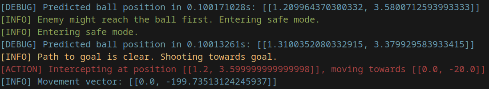
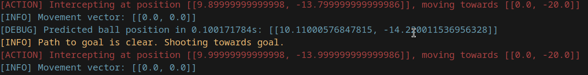
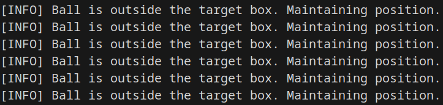

# Midas

Midas is an advanced defense algorithm developed by **Team Elite** from the USA for use in robotics competitions such as RoboCup Junior. This algorithm offers a highly sophisticated and mathematical approach to solving one of the most challenging aspects of robotic soccer: defending effectively against skilled offensive maneuvers. Midas is designed with a focus on predictive analysis, real-time decision-making, and adaptability, making it a powerful tool for robotics enthusiasts and competitors alike.

---

## Table of Contents
1. [History](#history) 📜
2. [Program Overview](#program-overview) 📊
3. [Mathematical Foundations](#mathematical-foundations) 🧮
4. [Code Walkthrough](#code-walkthrough) 💻
5. [How to Use Midas](#how-to-use-midas) ⚙️
6. [Sample Outputs](#sample-outputs) 🖼️
7. [Future Development](#future-development) 🚀

---

## History

The journey of **Team Elite** into robotics defense began with a frustration shared by many competitors: the lack of reliable, efficient defense algorithms. In competitive competitions such as RoboCup Junior, traditional algorithms often struggle against advanced offensive strategies. Observing these limitations, we were driven to develop Midas, a next-generation defense algorithm that combines  physics, machine intelligence, calculus, and real-time trajectory analysis.

Over months of rigorous development and testing, Midas evolved into a robust system. Inspired by principles of robotics, mathematics, and teamwork, Team Elite is excited to share this innovation with the community to inspire the next generation of RoboCup Junior competitors.

---

## Program Overview

Midas is a program designed to simulate a robotic goalie in a soccer scenario. It predicts the ball's trajectory, calculates interception points, and evaluates the best course of action, whether it’s intercepting the ball or maintaining a safe position. The program also factors in the movements of opposing players to determine the optimal strategy.

### Key Features
- **Trajectory Prediction:** 🛠️ Uses position, velocity, acceleration, and jerk to calculate the trajectory of the ball rolling.
- **Interception Decision:** ⚡ Compares the time-to-reach metrics of both the goalie and an opposing player to decide if interception is worth the risk.
- **Path Analysis:** 🛤️ Simulates a Bezier curve to determine if a clear path to the goal or teammate exists.
- **Error Correction:** 🩹 Dynamically adjusts predictions to minimize computational inaccuracies. (Still needs some improvement)
- **Logging:** 📝 Provides real-time colored logs for debugging and insights.

---

## Mathematical Foundations

Team Elite build their algorithms by first defining the mathamatics. Here is a quick overview of the math used to design Midas:

### 1. **Trajectory Prediction**
The future position of the ball is calculated using the kinematic equation:

**Predicted Position** = P + V · Δt + ½ A · (Δt)² + ⅜ J · (Δt)³

Where:
- P: Current position of the ball
- V: Current velocity of the ball
- A: Current acceleration of the ball
- J: Current jerk (rate of change of acceleration)
- Δt: Time step

### 2. **Interception Time Calculation**
To determine if the goalie should intercept the ball, the robot must first calculate the distance that the goalie and opponet striker must travel to reach the ball. If the striker has over 75% times the distance that the goalie has to travel, than the goalie will try to intercept the ball.

### 3. **Bezier Curve Path Simulation**
To evaluate whether a clear path exists to the goal or a teammate, a quadratic Bezier curve is used:

B(t) = (1 − t)² · P₀ + 2(1 − t)t · P₁ + t² · P₂

Where:
- P₀: Current position of the goalie
- P₁: Midpoint between the goalie and the target
- P₂: Target position (goal or teammate)

Collision detection is performed by checking if any point along the curve is within a threshold distance from the opponent.

### 4. **Error Correction**
To mitigate small errors in prediction, an error correction factor is added:

Pₚ = Pₙ + k · (Pₙ − Pₓ)

Where k is a tunable parameter. We opted not to use standard machine learning here due to the time sensitivity of this task.

---

## Code Walkthrough

### 1. **Main Components**
The program is structured into three primary classes:
- **Ball:** ⚽ Tracks the ball’s position, velocity, acceleration, and jerk. Provides functionality to predict future positions.
- **Enemy:** 🚨 Models an opposing player with position and velocity. Calculates time-to-reach for interception.
- **Goalie:** 🥅 Handles decision-making, path analysis, and movement updates. Includes logic for safe mode and interception.

### 2. **Trajectory Prediction**
The `predict_position` function in the `Ball` class uses the kinematic equation to predict the ball’s position at a future time step. It also incorporates a small error correction factor to improve accuracy.

### 3. **Interception Decision**
The `decide_action` function in the `Goalie` class evaluates whether interception is feasible by comparing the goalie’s and enemy’s time-to-reach metrics. If interception is unlikely, the goalie enters a "safe mode" to maintain position.

### 4. **Path Analysis with Bezier Curves**
The `bezier_path_blocked` function simulates a quadratic Bezier curve and checks for collisions along the curve. This determines if the goalie should pass to a teammate or shoot toward the goal.

### 5. **Logging**
Colored logs provide real-time feedback for debugging and analysis. Example:
- 🟥 Red: Critical actions (e.g., interception)
- 🟩 Green: Safe mode or reset
- 🟦 Blue: Detailed debug information
- 🟨 Yellow: Decision-making insights

---

## How to Use Midas

### Prerequisites
- 🔧 Rust (latest stable version)
- 📦 nalgebra crate for vector mathematics

### Installation
1. Clone the repository:
   ```bash
   git clone https://github.com/TeamEliteUSA/Midas.git
   cd Midas
   ```
2. Build the program:
   ```bash
   cargo build --release
   ```
3. Import into your own project
   ```rs
   mod midas;
   ```
### Configuration
Edit constants at the top of the program for tuning:
- 🛠️ `INTERCEPT_THRESHOLD`: Adjusts the balance between interception and safe mode.
- ⚙️ `ERROR_CORRECTION_FACTOR`: Controls trajectory correction.

---

## Sample Outputs

### Screenshot 1: Different modes

Midas Can recognize certain conditions and act accordingly

### Screenshot 2: Interceptions

Midas doesn't just block shots, it does a full counter-offensive! Midas can shoot towards the goal if nothing is blocking it's path!

### Screenshot 3: Target box
Midas will not act unless a ball enters it's "target path" which is a box around the goal. During this time, Midas is carefully watching the physics behind how the ball is moving.


---

## Future Development

Midas is constantly being improved by our team's hard working developers. Here are some of our future improvements we'd like to make:
- **ML Based Trajectory Prediction:** 🤖 Use advanced Kalman filters to optimize decision-making.
- **Dynamic Speed Adjustment:** ⏩ Introduce adaptive speed based on real-time scenarios.
- **Advanced Pathfinding:** 🛣️ Use higher-order Bezier curves or splines for more accurate path analysis.

We encourage contributions from the community to expand the capabilities of Midas and make it even more effective for robotic defense.

---

## License
Midas is released under the MIT License. Feel free to use, modify, and distribute the code with attribution.

---

## Acknowledgments
Special thanks to RoboCup Junior organizers for inspiring innovation and to all the competitors whose challenges pushed us to develop Midas.

